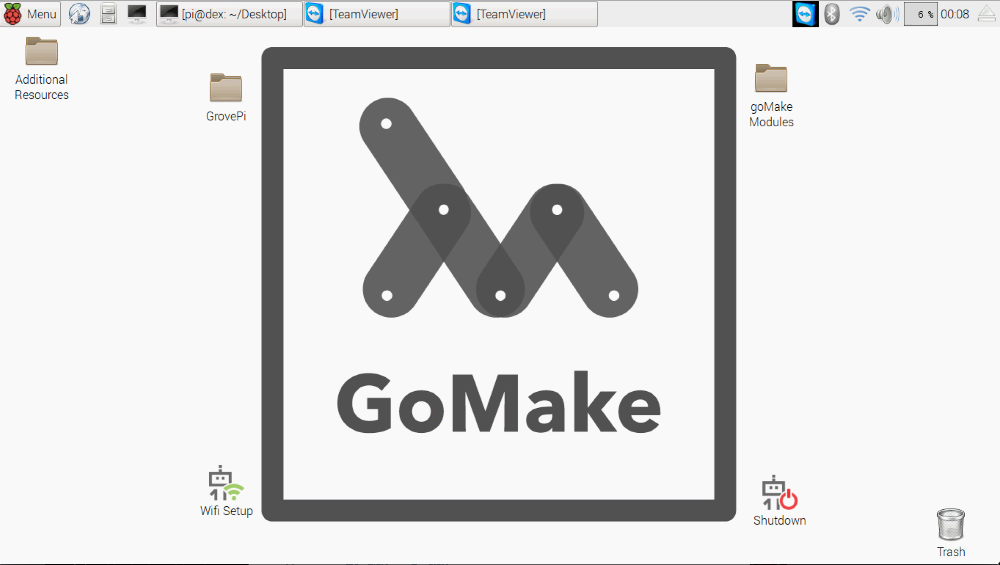
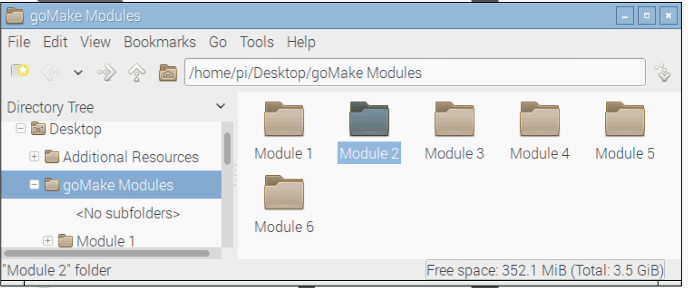
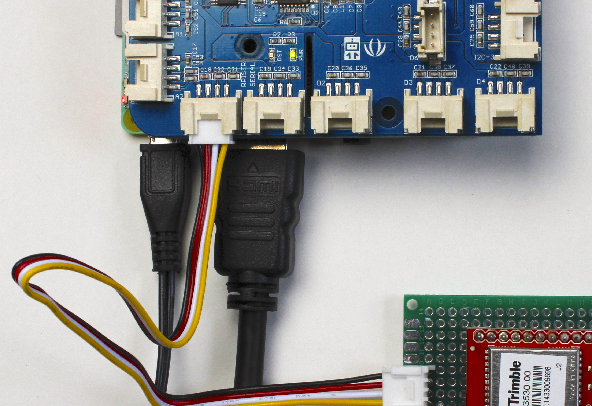

<!DOCTYPE html>
<html>
<title>Hello Strapdown</title>

< xmp theme="cerulean" style="display:none;" >

# Module 2: The Space Computer

Hello again fellow Space Fairer, and welcome to Module 2. 
	
It's time to explore the Grove Pi and find out what it's capable of when attached to the Raspberry Pi. With their powers combined, we will be able to read and record all kinds of environmental information and learn from that data what actually happens when we travel up into the earth's atmosphere. But first, we must build our <b>Telemetry System</b> by using a combination of sensor units and programming code. 


## What is it like to stand at the edge of space?


Your balloon's <b>Telemetry System</b>, or as we like to call it, the goMake <i>Space Computer</i>, will allow you and your team to read atmospheric conditions at the very top of the earth's atmosphere. As the balloon rises, it will leave the earth below and enter a new and unfamiliar place, very different than where you are standing right now.

At about 100,000 feet, or 19 miles above the earth, interesting things start to happen. Have you ever heard of the Stratosphere? That's where we're going with our HAB. In the Stratosphere, there is very air to breath, atmospheric pressure (that which causes your ears to pop when you go up to higher altitudes) is far far lower than on earth and it's very, very cold! Also, it's where the Ozone layer exists, which protects us from harmful cosmic rays.

<b>Do you think you could surive up in the Stratosphere without a space suit?</b>


## Things You Will Need
Before we get started, let's account for the pieces of equipment that we'll need to build our Space Computer. 

### Parts
* <b>Raspberry Pi & Grove Pi units

> 

* GPS Sensor & Antenna

> 

* Temperature and Humidity Sensor 

> 

* Sound Sensor 

> 

* LCD RGB Display 

> 

* Sattelite Modem</b>

> 


### Additional Tools
This module is fairly straight forward, you won't be needing any super advanced tools to make this telemetry unit function. However, here are a few additional items you <i>will</i> need to build and test the Telemetry System:


* <b>Monitor with HDMI-in to display the Raspberry Pi OS</b>

* <b>HDMI Cable</b>

* <b>Keyboard & its wireless dongle, provided by <i>goMake</i></b>


## Let's build us a Space Computer!

### Step 1. Activating the RPi & Grove Pi and get ourselves set up.
Make sure that your RPi is connected to a monitor via the HDMI cable, and that the keyboard dongle is plugged into one of the RPi's USB inputs. 

Now that we have our Keyboard and HDMI plugged in, turn on your monitor and plug in the RPi's power cord and <i>voilà</i>, the OS will boot!


>  
> Caption Picture of RPi connected 

### 2. Starting at the HomeScreen
> 


1. From your Raspberry Pi Homescreen, click on the Modules folder, then Module 2.md

> 

2. Click on Module2.pdf to access the module and we're off!


### 3. Let's build this thing!

We're going to now build the unit.

### A) GPS

a.1) Connect the GPS unit to its antenna by screwing in the antenna to the gold colored input.
>  
> 
>  

a.2) Connect the GPS unit to the Grove Pi (Look for **Connector A2**)
> 


### that was it! Now let's see if it worked)  

a.3) Go to your desktop and double click on the TEST icon. This will run your code in a terminal window, which activates the GPS, giving us the GPS unit's location in the form of degrees of latitude, longitude, and altitude measured in feet, as well as the cardinal direction.  

See the image below for an example of what it should look like.


### What if it didn't work?

Try the following
>
1. Make sure your RPi is plugged in and the lights are on.
2. Ensure that the GPS Antenna (the black thing) has nothing blocking it from the sky. Try putting it next to a window, that oughta do it.
3. Check to see if the GPS unit is plugged into the right port on the Grove Pi (A2). 
4. If you're still having trouble, see your instructor for some help.

#####If it worked, you can close the 'TEST' terminal and move on to the next step.

###B) Temperature Sensor
b.1) Plug in the Temperature Sensor Unit into the Grove Pi (Connector D7)
> 


b.2) Now we've got to prepare the code. We're going copy the following code into your forge, under the Temperature Sensor Tab. 

Step 1. Highlight and then copy this text.
```
Enter the code for the temp sensor here
```

Step 2. Open up your forge from the desktop if you do not already have it open.

Step 3. Click on the Temperature Sensor tab in the Forge
> 


Step 4. Paste the code 
> 


###Great! Now we're going to test our code to see if the Temperature Sensor is telling us how hot or cold it is

b.3) Just like we did when testing the GPS unit, go to your desktop and double click the 'TEST' icon. The code will run in a terminal window, and will look like what we see in the image below. 

*** Note that if the GPS coordinates are not working, it may be because the antenna does not have a direct line of site to the sky. It's okay, we don't need to worry about it at this point. Onward!

### What if it didn't work?

Try the following
>
1. Make sure your RPi is plugged in and the lights are on.
2. Ensure that the Temperature Sensor is plugged into the right port on the Grove Pi (Connector D7). 
3. Make sure that the code was copied and pasted in the Temperature Sensor Tab, and that there aren't any additional characters that might have been typed in by accident. If you aren't sure, delete all the code in the tab, and re-paste it from this document again.
4. If you're still having trouble, see your instructor for some help.

#####If it worked, you can close the 'TEST' terminal and move on to the next step.

###C) Sound Sensor
c.1) Plug in the Sound Sensor Unit into the Grove Pi (Look for **Connector A0**)
> 

b.2) Now we've got to prepare the code. We're going copy the following code into your forge, under the Sound Sensor Tab. 

Step 1. Highlight and then copy this text.
```
Enter the code for the sound sensor here
```

Step 2. Open up your forge from the desktop if you do not already have it open.

Step 3. Click on the Sound Sensor tab in the Forge
> 


Step 4. Paste the code 
> 


###Great! Now we're going to test our code to see if the Sound Sensor is picking up noises

c.3) Run the 'Test' Icon from your desktop. This will run the code in a terminal window, and it will show the relative volume of sound occuring around the Sound Sensor. 

####A more fun way to test:
>Try clapping your hands loudly near the sensor, or talking loudly around it. Note how the data changes based off of the volume that it reads. Now try to get the room as quiet as possible. See the difference? 

### What if it didn't work?

Try the following
>
1. Make sure your RPi is plugged in and the lights are on.
2. Ensure that the Sound Sensor is plugged into the right port on the Grove Pi (Connector A0). 
3. Make sure that the code was copied and pasted in the Sound Sensor Tab, and that there aren't any additional characters that might have been typed in by accident. If you aren't sure, delete all the code in the tab, and re-paste it from this document again.
4. If you're still having trouble, see your instructor for some help.


###D) LCD RGB Display
d.1) Plug in the Display Sensor Unit into the Grove Pi (Connector I2C-2)
> 

d.2) Now we've got to prepare the code, but this time, you're going to type the code manually! The image below contains the exact code to make the Display work - it's your job to type it in and to make it work. Here's how:

Step 1. Open up your forge from the desktop if you do not already have it open.

Step 2. Click on the RGB LCD Display Sensor tab in the Forge
> 

Step 3. Type in the code in the image right below into the RGB LCD Display sensor tab.
> 

Step 4. This is what it will look like when you're done
> 

###Excellent work. Now we're going to test to see if the code will active the Dipslay

d.3) Run the 'Test' Icon from your desktop. This will run the code in a terminal window, and will active the Display showing the text 'Hello World'.

####What else can we show on this display?
Instead of just saying Hello World, we're going to have this display show us temperature data that the Temperature Sensor is providing. 

####Here's how:

> Step 1. Close your 'Test' terminal, then go back to your Forge and click on the RGB LCD Display tab.

> Step 2. From within this tab, locate line #5, and alter the following code from:

> ```
> message = “Hello World:” 
> ```
> 
Step 3. to this:

> ```
> message = “temp (C):” + temperatureData
> ```

### What if it didn't work?

Try the following
>
1. Make sure your RPi is plugged in and the lights are on.
2. Ensure that the RGB LCD Display Sensor is plugged into the right port on the Grove Pi (Connector I2C-2). 
3. Make sure that the code was typed in exactly as shown in the image above within the  in the RGBLCD Dipsplay Sensor Tab, and that there aren't any additional characters that might have been typed in by accident. If you aren't sure, delete all the code in the tab, and re-type it and follow the steps over again.
4. If you're still having trouble, see your instructor for some help.


### 4. Concluding Module 2
Whoa... You now have a working system that can record environmental data in the stratosphere, as well as transmit the location of your airballoon in real time. Not only did you assemble this yourself, but you coded it and tested it to ensure that the systems were working together. Congratulations, that's pretty awesome. 

You might be asking yourself, <i>once we strap this thing to a high altitude air balloon, how will this computer and its modules manage to stay safe in the stratoshere? Isn't it super cold up there, and won't it just smash to pieces once it comes way back down to earth?</i> 

The answer is quite simple really, we're going to build a **space ship** for the telemetry system to fly in. In the next module, we wil show you how to build a mount for the RPi and Grove pi units, and once the system is solid and mounted, we're going to insert it into its very own safety container. Sure, it's made out of foam and not titanium like the space ships that are flown by NASA, but the mount and payload container will keep all of our sensors in place, as well as provide a snug, warm environment to protect from the stratosphere. 

 


##Let's get to it!


## Questions & Feedback

### Record Your Thoughts:
Are there any important experiences or data you want to record for future sessions or later discussion with the team? Discuss with 


</xmp>

<script src="http://strapdownjs.com/v/0.2/strapdown.js"></script>
</html>
